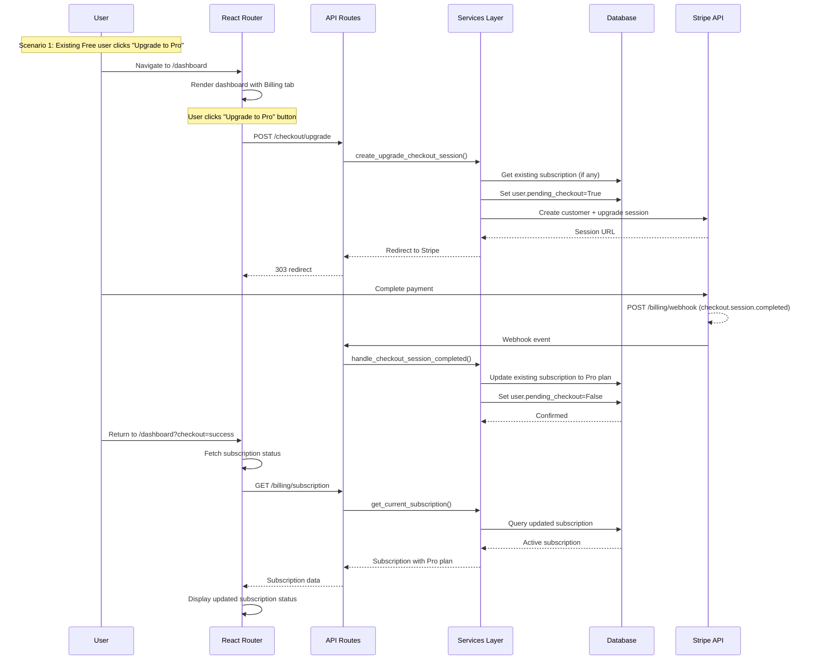

# Technical Design Document

## Overview

This document describes the technical implementation of the subscription system for Volta. The system enables users to subscribe to different plan tiers (Free, Pro, Enterprise/Custom) through Stripe payment processing with automatic synchronization of subscription state.

The implementation addresses all 7 requirements:
1. **Seed Default Plans** - Auto-create Free/Pro plans on startup
2. **Complete Checkout Flow** - Stripe checkout for Free→Pro upgrade
3. **Synchronize Subscription State** - Stripe webhook sync
4. **Fallback to Free Plan** - Auto-enforce Free limits when subscription ends
5. **Upgrade Subscription** - Handle existing subscriber upgrades
6. **View Current Subscription** - Endpoint to see subscription status

### Dashboard Integration

The subscription system is now integrated into the existing dashboard:

1. **Billing Section** - Available as a tab within `/dashboard`:
   - Displays current subscription status (plan tier, status, period)
   - "Upgrade to Pro" button triggers Stripe checkout
   - No "Contact Sales" button (contact-sales remains as standalone route)

2. **Standalone Contact Sales Route** - `/contact-sales` preserved:
   - Same functionality as existing contact-sales page
   - Accessible at `/contact-sales` URL
   - Backend endpoint `/contact/sales` remains available

### Checkout Flow (Updated)

The checkout flow has been updated to support both new user registration and existing Free user upgrades:

**New User Flow (Existing):**
- User registers and selects Pro plan → `pending_checkout=True` set during registration
- User clicks "Subscribe" → redirects to `/checkout/complete`
- `/checkout/complete` creates checkout session for Free plan

**Existing Free User Flow (NEW):**
- Existing Free user clicks "Upgrade to Pro" in dashboard
- Frontend calls `POST /checkout/upgrade` with optional current subscription ID
- `/checkout/upgrade` sets `pending_checkout=True` and creates upgrade checkout session
- User redirected to Stripe with upgrade metadata
- Upon completion, existing subscription updated to Pro plan

**Checkout Endpoints:**
- `GET /checkout/complete` - Creates checkout session for existing Free plan (requires `pending_checkout=True`)
- `POST /checkout/cancel` - Cancels pending checkout (`pending_checkout=False`)
- `POST /checkout/upgrade` - Creates upgrade checkout session for existing Free user (NEW)

## Architecture

```
┌─────────────────────────────────────────────────────────────────────┐
│                           Frontend Layer                            │
│  • /dashboard (React Router) - Integrated billing section           │
│    - Overview tab (existing)                                        │
│    - Access Tokens tab (existing)                                   │
│    - Audit Log tab (existing)                                       │
│    - Billing tab (existing)                                         │
│  • /contact-sales (React Router) - Standalone contact form          │
└─────────────────────────────────────────────────────────────────────┘
                            │
                            ▼
┌─────────────────────────────────────────────────────────────────────┐
│                         API Routes Layer                            │
│  • /checkout/complete        - Initiate checkout session            │
│  • /checkout/cancel          - Cancel pending checkout              │
│  • /billing/webhook          - Stripe webhook handler               │
│  • /billing/subscription     - View subscription status             │
└─────────────────────────────────────────────────────────────────────┘
                            │
                            ▼
┌─────────────────────────────────────────────────────────────────────┐
│                       Services Layer                                │
│  • billing.py    - Stripe integration, webhook handling             │
│  • email.py      - Email notifications                              │
└─────────────────────────────────────────────────────────────────────┘
                            │
                            ▼
┌─────────────────────────────────────────────────────────────────────┐
│                       Database Layer (PostgreSQL)                   │
│  • plans              - Plan definitions (Free/Pro/Custom)          │
│  • subscriptions      - User subscription records                   │
│  • users              - User records (with stripe_customer_id)      │
└─────────────────────────────────────────────────────────────────────┘
                            │
                            ▼
┌─────────────────────────────────────────────────────────────────────┐
│                        External Services                            │
│  • Stripe API      - Payment processing, checkout, webhooks         │
│  • SMTP Server     - Email delivery for contact sales               │
└─────────────────────────────────────────────────────────────────────┘
```

### Component Diagram



## Components and Interfaces

### API Routes

| Endpoint | Method | Description |
|----------|--------|-------------|
| `/checkout/complete` | GET | Initiate Stripe checkout session for Pro plan (requires `pending_checkout=True`) |
| `/checkout/cancel` | POST | Cancel pending checkout and reset user state (`pending_checkout=False`) |
| `/checkout/upgrade` | POST | Initiate upgrade checkout session for existing Free user (sets `pending_checkout=True`) |
| `/billing/webhook` | POST | Handle Stripe webhook events |
| `/billing/subscription` | GET | Get current user's subscription status |
| `/contact/sales` | POST | Handle contact sales inquiry form submission |

**Note:** `/contact-sales` frontend route preserved as standalone page. Backend endpoint `/contact/sales` remains available for the standalone page.

### Service Functions

| Function | Purpose |
|----------|---------|
| `get_pro_plan()` | Retrieve active Pro plan with Stripe price_id |
| `ensure_stripe_customer()` | Create or retrieve Stripe customer for user |
| `create_checkout_session()` | Create Stripe checkout session for Free plan |
| `create_upgrade_checkout_session()` | Create upgrade checkout session for existing subscription |
| `handle_checkout_session_completed()` | Process successful checkout (Free or upgrade) |
| `handle_subscription_updated()` | Process Stripe subscription update |
| `handle_subscription_deleted()` | Process Stripe subscription cancellation |
| `seed_default_plans()` | Seed Free and Pro plans on startup |
| `send_contact_sales_email()` | Send contact sales inquiry email |

## Data Models

### Plan Model (Existing)

```python
class Plan(Base):
    id: int
    tier: PlanTier (FREE, PRO, CUSTOM)
    name: str
    price_cents: int | None
    stripe_price_id: str | None
    requests_per_day: int | None  # NULL = unlimited
    api_key_limit: int | None
    history_days: int | None
    priority_support: bool
    webhook_notifications: bool
    dedicated_support: bool
    custom_sla: bool
    on_prem: bool
    is_active: bool
```

### Subscription Model (Existing)

```python
class Subscription(Base):
    id: int
    user_id: int
    plan_id: int
    status: SubscriptionStatus (ACTIVE, PAST_DUE, CANCELED, TRIALING)
    custom_price_cents: int | None
    custom_terms: str | None
    stripe_subscription_id: str | None
    current_period_start: datetime
    current_period_end: datetime | None
    canceled_at: datetime | None
```

### User Model (Existing)

```python
class User(Base):
    id: int
    email: str
    pending_checkout: bool  # Track active checkout flow
    stripe_customer_id: str | None  # Link to Stripe customer
```

## Correctness Properties

*A property is a characteristic or behavior that should hold true across all valid executions of a system—essentially, a formal statement about what the system should do. Properties serve as the bridge between human-readable specifications and machine-verifiable correctness guarantees.*

### Property 1: Plan Seeding Idempotence

*For any* startup sequence, running the seed default plans mechanism multiple times SHALL result in exactly one Free plan and one Pro plan existing in the database with the correct tier values.

**Validates: Requirements 1.1, 1.2, 1.3, 1.4, 1.5**

### Property 2: Checkout Session Uniqueness

*For any* user with a pending checkout, creating a new checkout session SHALL fail with an error indicating checkout is in progress until the current checkout is completed or canceled.

**Validates: Requirements 2.6**

### Property 3: Subscription Status Synchronization

*For any* valid Stripe webhook event, the local subscription status SHALL accurately reflect the Stripe subscription status within seconds of the event occurrence.

**Validates: Requirements 3.1, 3.2, 3.3, 3.4, 3.5, 3.6**

### Property 4: Free Plan Limit Enforcement

*For any* user with no active subscription (CANCELED status), the system SHALL enforce Free plan limits (daily_request_limit from settings) without exception.

**Validates: Requirements 4.2**

### Property 5: Upgrade Subscription Preservation

*For any* existing subscription with status ACTIVE or PAST_DUE, upgrading to Pro SHALL create a new checkout session that, upon completion, updates the existing subscription to point to the Pro plan rather than creating a duplicate subscription.

**Validates: Requirements 5.1, 5.2, 5.3, 5.4**

### Property 6: Upgrade Checkout Session Creation

*For any* existing Free user with `pending_checkout=False`, clicking "Upgrade to Pro" SHALL set `pending_checkout=True` and create a Stripe checkout session with upgrade metadata, enabling the user to upgrade their subscription.

**Validates: Requirements 2.7**

### Property 7: Upgrade Subscription Preservation

*For any* existing subscription with status ACTIVE or PAST_DUE, upgrading to Pro SHALL create a new checkout session that, upon completion, updates the existing subscription to point to the Pro plan rather than creating a duplicate subscription.

**Validates: Requirements 5.1, 5.2, 5.3, 5.4**

### Property 8: Canceled Subscription Renewal

*For any* user with a CANCELED subscription, clicking "Subscribe" SHALL create a new subscription (not update the canceled one) and initiate a new checkout flow.

**Validates: Requirements 5.5**

### Property 9: Contact Sales Email Content

*For any* successful contact sales form submission, the email notification SHALL include all submitted fields (name, email, company, team size, message) and the user's current plan tier.

**Validates: Requirements 6.2**

## Error Handling

### Stripe Integration Errors

| Error Type | HTTP Status | Response | Handling Strategy |
|------------|-------------|----------|-------------------|
| Stripe price_id missing | 500 | "Checkout is not available right now." | Log error, prevent checkout creation |
| Stripe customer creation fails | 502 | "Could not start checkout." | Rollback, return error |
| Invalid webhook signature | 400 | "Invalid payload." | Reject request immediately |
| Webhook references unknown user | 200 | Success response | Log error, continue processing |
| Webhook references unknown subscription | 200 | Success response | Log warning, continue processing |
| Checkout URL is None | 500 | "Checkout is not available right now." | Log error, prevent redirect |

### Database Errors

| Error Type | HTTP Status | Response | Handling Strategy |
|------------|-------------|----------|-------------------|
| IntegrityError (duplicate subscription) | 500 | "Internal server error" | Rollback, log detailed error |
| Query returns None (unexpected) | 500 | "Internal server error" | Log error, rollback |
| Transaction commit fails | 500 | "Internal server error" | Rollback, log detailed error |

### Email Errors

| Error Type | HTTP Status | Response | Handling Strategy |
|------------|-------------|----------|-------------------|
| SMTP connection fails | 500 | "Something went wrong on our end." | Return generic error, log details |
| Email configuration missing | 500 | "Something went wrong on our end." | Return generic error, log details |
| Email sending fails | 500 | "Something went wrong on our end." | Return generic error, log details |

## Testing Strategy

### Unit Tests

Unit tests will verify specific examples, edge cases, and error conditions:

1. **Plan Seeding**
   - Test Free plan creation when missing
   - Test Pro plan creation with Stripe price_id
   - Test Pro plan update when price_id changes
   - Test idempotency (multiple runs don't create duplicates)

2. **Checkout Session Creation**
   - Test successful session creation (Free plan)
   - Test successful upgrade session creation
   - Test error when Pro plan not configured
   - Test error when user has pending checkout
   - Test Stripe customer creation

3. **Upgrade Checkout Flow**
   - Test upgrade session creation with existing subscription
   - Test upgrade session creation without existing subscription
   - Test upgrade session with upgrade metadata
   - Test pending_checkout flag set correctly

4. **Webhook Handling**
   - Test checkout.session.completed event
   - Test customer.subscription.updated event
   - Test customer.subscription.deleted event
   - Test webhook with unknown user
   - Test webhook with unknown subscription
   - Test invalid webhook signature

5. **Dashboard Integration**
   - Test subscription status fetch (billing/subscription endpoint)
   - Test contact sales modal email sending
   - Test error handling for SMTP failures

6. **Subscription Queries**
   - Test active subscription retrieval
   - Test CANCELED subscription retrieval
   - Test subscription with no subscription

### Property-Based Tests

Property-based tests will verify universal properties across all inputs:

1. **Plan Seeding Idempotence**
   - *Property:* Running seed mechanism N times produces exactly 1 Free + 1 Pro plan
   - *Test:* Generate random startup sequences, verify plan count
   - *Iterations:* 100+

2. **Subscription Status Synchronization**
   - *Property:* For all valid Stripe webhook events, local status matches Stripe status
   - *Test:* Generate random Stripe events, verify synchronization
   - *Iterations:* 100+

3. **Free Plan Limit Enforcement**
   - *Property:* For all users with CANCELED status, Free limits are enforced
   - *Test:* Generate users with different subscription states, verify enforcement
   - *Iterations:* 100+

### Integration Tests

Integration tests will verify end-to-end workflows against a test database:

1. **Complete Checkout Flow (Free plan)**
   - Seed plans
   - Create Stripe customer
   - Complete checkout
   - Verify subscription created
   - Verify user state updated

2. **Upgrade Subscription Flow**
   - Create existing subscription (Free plan)
   - Call POST /checkout/upgrade
   - Verify pending_checkout=True
   - Verify upgrade checkout session created with correct metadata
   - Complete upgrade via webhook
   - Verify subscription updated to Pro (not duplicated)

3. **Upgrade Without Existing Subscription**
   - Create user with no subscription
   - Call POST /checkout/upgrade
   - Verify pending_checkout=True
   - Verify checkout session created for Free plan
   - Complete checkout via webhook
   - Verify new subscription created

4. **Webhook Synchronization**
   - Create subscription via checkout
   - Simulate Stripe webhook (updated status)
   - Verify local subscription updated

5. **Dashboard Integration**
   - Verify billing tab fetches subscription status
   - Verify upgrade button triggers checkout
   - Verify contact sales modal opens and submits correctly

6. **Edge Cases**
   - Upgrade with canceled subscription (should create new subscription)
   - Upgrade with past_due subscription (should update existing subscription)
   - Multiple upgrade attempts (pending_checkout prevents duplicate)

### Test Tags

Each property-based test MUST be tagged with:
```
Feature: subscription-system, Property {number}: {property_text}
```

## Implementation Details

### Plan Seeding Mechanism

**Location:** `src/ml_server/services/billing.py` (new function)

```python
async def seed_default_plans(session: AsyncSession, settings: Settings) -> None:
    """Seed Free and Pro plans on startup if they don't exist."""
    # Check if Free plan exists
    result = await session.execute(select(Plan).where(Plan.tier == PlanTier.FREE))
    free_plan = result.scalar_one_or_none()
    
    if free_plan is None:
        # Create Free plan with default limits
        free_plan = Plan(
            tier=PlanTier.FREE,
            name="Free",
            price_cents=0,
            stripe_price_id=None,
            requests_per_day=None,  # unlimited
            api_key_limit=None,     # unlimited
            history_days=None,      # unlimited
            priority_support=False,
            webhook_notifications=False,
            dedicated_support=False,
            custom_sla=False,
            on_prem=False,
            is_active=True,
        )
        session.add(free_plan)
        await session.flush()
    
    # Check if Pro plan exists
    result = await session.execute(select(Plan).where(Plan.tier == PlanTier.PRO))
    pro_plan = result.scalar_one_or_none()
    
    if pro_plan is None:
        # Create Pro plan if stripe_price_id is configured
        if settings.stripe.price_id is None:
            logger.warning("Pro plan not configured - stripe_price_id not set")
            return
        
        pro_plan = Plan(
            tier=PlanTier.PRO,
            name="Pro",
            price_cents=None,  # Negotiated via Stripe
            stripe_price_id=settings.stripe.price_id.get_secret_value(),
            requests_per_day=None,  # unlimited
            api_key_limit=None,     # unlimited
            history_days=None,      # unlimited
            priority_support=True,
            webhook_notifications=True,
            dedicated_support=False,
            custom_sla=False,
            on_prem=False,
            is_active=True,
        )
        session.add(pro_plan)
        await session.flush()
    elif pro_plan.stripe_price_id is None:
        # Update Pro plan if price_id is configured but not set
        if settings.stripe.price_id is not None:
            pro_plan.stripe_price_id = settings.stripe.price_id.get_secret_value()
            await session.flush()
```

**Startup Hook:** `src/ml_server/app.py` (lifespan)

```python
@asynccontextmanager
async def lifespan(app: FastAPI):
    # ... existing initialization code ...
    
    # Seed default plans
    async with async_sessionmaker(engine, expire_on_commit=False)() as session:
        await seed_default_plans(session, settings)
    
    yield
    
    # ... cleanup code ...
```

### Contact Sales Endpoint

**Location:** `src/ml_server/routes/contact_sales.py` (existing file - preserved)

The `/contact/sales` endpoint remains available for the standalone `/contact-sales` frontend page.

```python
from fastapi import APIRouter, Depends, HTTPException
from sqlalchemy.ext.asyncio import AsyncSession
from typing import Annotated

from src.ml_server.conf.settings import Settings
from src.ml_server.dependencies.settings import get_settings
from src.ml_server.dependencies.db import get_session
from src.ml_server.dependencies.current_user import get_current_user
from src.ml_server.models.user import User
from src.ml_server.services.email import send_contact_sales_email

router = APIRouter()


class ContactSalesRequest(BaseModel):
    name: str
    email: str
    company: str
    team_size: str
    message: str


@router.post("/contact/sales")
async def contact_sales(
    body: ContactSalesRequest,
    user: Annotated[User, Depends(get_current_user)],
    session: Annotated[AsyncSession, Depends(get_session)],
    settings: Annotated[Settings, Depends(get_settings)],
):
    """Handle contact sales inquiry form submission (for standalone contact-sales page)."""
    # Get user's current plan tier
    plan_tier = "Free"  # Default if no subscription
    if user.subscriptions:
        active_sub = next((s for s in user.subscriptions if s.status == "active"), None)
        if active_sub:
            plan_tier = active_sub.plan.tier
    
    try:
        await send_contact_sales_email(
            recipient=settings.smtp.sales_email,
            name=body.name,
            email=body.email,
            company=body.company,
            team_size=body.team_size,
            message=body.message,
            current_plan_tier=plan_tier,
            settings=settings,
        )
        return {"message": "Message sent successfully"}
    except Exception as e:
        logger.error(f"Failed to send contact sales email: {e}")
        raise HTTPException(status_code=500, detail="Something went wrong on our end.")
```

### View Subscription Endpoint

**Location:** `src/ml_server/routes/billing.py` (new file)

```python
from fastapi import APIRouter, Depends
from sqlalchemy.ext.asyncio import AsyncSession
from typing import Annotated

from src.ml_server.dependencies.db import get_session
from src.ml_server.dependencies.current_user import get_current_user
from src.ml_server.models.user import User
from src.ml_server.models.subscription import Subscription, SubscriptionStatus

router = APIRouter()


class PlanResponse(BaseModel):
    id: int
    tier: str
    name: str
    requests_per_day: int | None
    api_key_limit: int | None
    history_days: int | None


class SubscriptionResponse(BaseModel):
    status: str
    current_period_start: str
    current_period_end: str | None
    plan: PlanResponse | None


@router.get("/billing/subscription")
async def get_subscription(
    user: Annotated[User, Depends(get_current_user)],
    session: Annotated[AsyncSession, Depends(get_session)],
) -> SubscriptionResponse:
    """Get current user's subscription status."""
    # Get subscription with plan
    from sqlalchemy import select
    result = await session.execute(
        select(Subscription)
        .options(selectinload(Subscription.plan))
        .where(Subscription.user_id == user.id)
        .order_by(Subscription.created_at.desc())
    )
    subscription = result.scalar_one_or_none()
    
    if subscription is None or subscription.status == SubscriptionStatus.CANCELED:
        return SubscriptionResponse(
            status="canceled",
            current_period_start=None,
            current_period_end=None,
            plan=None,
        )
    
    return SubscriptionResponse(
        status=subscription.status.value,
        current_period_start=subscription.current_period_start.isoformat(),
        current_period_end=subscription.current_period_end.isoformat() if subscription.current_period_end else None,
        plan=PlanResponse(
            id=subscription.plan.id,
            tier=subscription.plan.tier.value,
            name=subscription.plan.name,
            requests_per_day=subscription.plan.requests_per_day,
            api_key_limit=subscription.plan.api_key_limit,
            history_days=subscription.plan.history_days,
        ),
    )
```

### Upgrade Subscription Logic

**Location:** `src/ml_server/services/billing.py` (new function)

```python
async def create_upgrade_checkout_session(
    *,
    settings: Settings,
    session: AsyncSession,
    user: User,
    current_subscription: Subscription,
    success_url: str,
    cancel_url: str,
) -> stripe.checkout.Session:
    """Create a checkout session for upgrading an existing subscription."""
    pro_plan = await get_pro_plan(session)
    
    customer_id = await ensure_stripe_customer(session, user, settings)
    
    # Create session with subscription data to upgrade existing subscription
    return await stripe.checkout.Session.create_async(
        api_key=settings.stripe.secret_key.get_secret_value(),
        mode="subscription",
        customer=customer_id,
        subscription=current_subscription.stripe_subscription_id,
        subscription_data={
            "metadata": {
                "user_id": str(user.id),
                "current_subscription_id": current_subscription.stripe_subscription_id,
            }
        },
        line_items=[{"price": pro_plan.stripe_price_id, "quantity": 1}],
        success_url=success_url,
        cancel_url=cancel_url,
    )
```

### Database Schema Considerations

No database schema changes are required. The existing models already support all functionality:

1. **plans table** - Already has tier enum (FREE, PRO, CUSTOM)
2. **subscriptions table** - Already has status enum and Stripe integration fields
3. **users table** - Already has pending_checkout and stripe_customer_id fields

**Migrations:** A new Alembic migration is NOT required as the schema already supports all functionality.

**Initial Data:** The seeding mechanism will populate the `plans` table on first run.

## Integration with Existing Systems

### Billing Service

The existing `billing.py` service already handles:
- Stripe checkout session creation
- Webhook handling (checkout.session.completed, customer.subscription.updated, customer.subscription.deleted)
- Subscription synchronization from Stripe

We will extend this service with:
- `seed_default_plans()` - Plan seeding logic
- `create_upgrade_checkout_session()` - Upgrade flow support

### Email Service

The existing `email.py` service already handles email sending. We will add:
- `send_contact_sales_email()` - New email type for contact sales inquiries

### Authentication

The existing authentication system (OAuth2, PAT) is used for:
- User identification in all subscription endpoints
- Rate limiting (already integrated)
- Audit logging (already integrated)

## API Route Changes

### Routes Summary

**Removed:**
- None (all routes are preserved or integrated into dashboard)

**Kept:**
- `/billing/subscription` (GET) - View subscription status (integrated into dashboard)
- `/checkout/complete` (GET) - Initiate checkout session (Free plan, requires pending_checkout)
- `/checkout/cancel` (POST) - Cancel pending checkout
- `/checkout/upgrade` (POST) - Initiate upgrade checkout session (NEW)

**New:**
- `/checkout/upgrade` (POST) - Create upgrade checkout session for existing Free user

### Route Registration

`src/ml_server/app.py` - Both billing and contact sales routers are included:

```python
from src.ml_server.routes.billing import router as billing_router
from src.ml_server.routes.contact_sales import router as contact_sales_router

app.include_router(billing_router)
app.include_router(contact_sales_router)
```

### New Upgrade Endpoint Implementation

**Location:** `src/ml_server/routes/checkout.py` (new function)

```python
@router.post("/checkout/upgrade")
async def checkout_upgrade(
    req: Request,
    user: Annotated[User, Depends(get_current_user)],
    session: Annotated[AsyncSession, Depends(get_session)],
    settings: Annotated[Settings, Depends(get_settings)],
):
    """Create upgrade checkout session for existing Free user."""
    # Set pending_checkout=True to allow checkout to proceed
    user.pending_checkout = True

    try:
        plan = await billing_services.get_pro_plan(session)

        if plan.stripe_price_id is None:
            logger.error(f"Stripe price id is None in the plan with id = {plan.id}")
            raise HTTPException(status_code=500, detail="Checkout is not available right now.")

        customer_id = await billing_services.ensure_stripe_customer(session, user, settings)

        success_url = settings.hostname
        success_url += req.app.url_path_for("checkout_success")
        success_url += "?session_id={CHECKOUT_SESSION_ID}"

        cancel_url = settings.hostname + req.app.url_path_for("checkout_stripe_cancel")

        # Check if user has an existing subscription to upgrade
        from sqlalchemy import select
        from src.ml_server.models.subscription import Subscription
        
        result = await session.execute(
            select(Subscription)
            .where(Subscription.user_id == user.id)
            .order_by(Subscription.created_at.desc())
        )
        current_subscription = result.scalar_one_or_none()
        
        # Get current subscription's Stripe ID if exists (for upgrade)
        stripe_subscription_id = None
        if current_subscription and current_subscription.stripe_subscription_id:
            stripe_subscription_id = current_subscription.stripe_subscription_id
        
        checkout_session = await billing_services.create_upgrade_checkout_session(
            settings=settings,
            session=session,
            user=user,
            current_subscription=current_subscription,
            success_url=success_url,
            cancel_url=cancel_url,
        )
    except ValueError as e:
        logger.error(f"Checkout misconfiguration: {e}")
        raise HTTPException(status_code=500, detail="Checkout is not available right now.")
    except stripe.StripeError as e:
        logger.error(f"Stripe error creating upgrade checkout session for user {user.id}: {e}")
        await session.rollback()
        raise HTTPException(status_code=502, detail="Could not start checkout.")

    await log_event(
        db=session,
        user_id=user.id,
        event=EventCategory.billing_checkout_started,
        request=req,
    )

    try:
        await session.commit()
    except Exception as e:
        await session.rollback()
        logger.error(f"Failed to persist checkout upgrade for user {user.id}: {e}")
        raise HTTPException(status_code=500, detail="Internal server error")

    if checkout_session.url is None:
        logger.error(f"Checkout sessions's url is None for user with id = {user.id}")
        raise HTTPException(status_code=500, detail="Checkout is not available right now.")

    return RedirectResponse(url=checkout_session.url, status_code=303)
```

### Updated Checkout Session Creation for Upgrades

**Location:** `src/ml_server/services/billing.py` (updated function)

```python
async def create_upgrade_checkout_session(
    *,
    settings: Settings,
    session: AsyncSession,
    user: User,
    current_subscription: Subscription | None,
    success_url: str,
    cancel_url: str,
) -> stripe.checkout.Session:
    """Create a checkout session for upgrading an existing subscription."""
    pro_plan = await get_pro_plan(session)
    
    customer_id = await ensure_stripe_customer(session, user, settings)
    
    # Build line items for Pro plan
    line_items = [{"price": pro_plan.stripe_price_id, "quantity": 1}]
    
    # If user has an existing subscription, create upgrade session
    if current_subscription and current_subscription.stripe_subscription_id:
        # Create upgrade session that will update existing subscription
        return await stripe.checkout.Session.create_async(
            api_key=settings.stripe.secret_key.get_secret_value(),
            mode="subscription",
            customer=customer_id,
            client_reference_id=str(user.id),
            subscription=current_subscription.stripe_subscription_id,
            subscription_data={
                "metadata": {
                    "user_id": str(user.id),
                    "is_upgrade": "true",
                }
            },
            line_items=line_items,
            success_url=success_url,
            cancel_url=cancel_url,
            metadata={
                "user_id": str(user.id),
                "is_upgrade": "true",
            },
        )
    
    # If no existing subscription, create standard session (for Free users)
    return await stripe.checkout.Session.create_async(
        api_key=settings.stripe.secret_key.get_secret_value(),
        mode="subscription",
        customer=customer_id,
        client_reference_id=str(user.id),
        line_items=line_items,
        success_url=success_url,
        cancel_url=cancel_url,
        metadata={
            "user_id": str(user.id),
            "is_upgrade": "false",
        },
    )
```

### Updated Webhook Handler for Upgrades

**Location:** `src/ml_server/services/billing.py` (updated function)

```python
async def handle_checkout_session_completed(
    session: AsyncSession, settings: Settings, checkout_session: stripe.checkout.Session
) -> None:
    """Handle checkout completion, supporting both new and upgrade flows."""
    user_id_raw = checkout_session.client_reference_id or (
        checkout_session.metadata["user_id"]
        if checkout_session.metadata and "user_id" in checkout_session.metadata
        else None
    )
    is_upgrade = (
        checkout_session.metadata["is_upgrade"] == "true"
        if checkout_session.metadata and "is_upgrade" in checkout_session.metadata
        else False
    )
    stripe_subscription_id = str(checkout_session.subscription) if checkout_session.subscription else None
    stripe_customer_id = str(checkout_session.customer) if checkout_session.customer else None

    if not user_id_raw or not stripe_subscription_id:
        logger.error(f"checkout.session.completed missing user/subscription refs: {checkout_session}")
        return

    user_id = int(user_id_raw)
    result = await session.execute(select(User).where(User.id == user_id))
    user = result.scalar_one_or_none()
    if user is None:
        logger.error(f"checkout.session.completed for unknown user {user_id}")
        return

    if stripe_customer_id and not user.stripe_customer_id:
        user.stripe_customer_id = stripe_customer_id

    plan = await get_pro_plan(session)

    # If this is an upgrade, update the existing subscription
    if is_upgrade:
        # Get existing subscription and update it to Pro plan
        result = await session.execute(
            select(Subscription).where(
                Subscription.user_id == user_id,
                Subscription.stripe_subscription_id == stripe_subscription_id
            )
        )
        subscription = result.scalar_one_or_none()
        if subscription:
            # Update existing subscription to Pro plan
            subscription.plan_id = plan.id
            # Status will be set by _upsert_subscription_from_stripe
        else:
            # No existing subscription found, create new one
            await _upsert_subscription_from_stripe(
                session,
                user_id=user.id,
                plan_id=plan.id,
                stripe_subscription_id=stripe_subscription_id,
                settings=settings,
            )
    else:
        # Standard checkout - upsert subscription as before
        await _upsert_subscription_from_stripe(
            session,
            user_id=user.id,
            plan_id=plan.id,
            stripe_subscription_id=stripe_subscription_id,
            settings=settings,
        )

    user.pending_checkout = False
```

## Frontend Changes

### Dashboard Updates

The dashboard already has a "Billing" navigation item defined in `NAV` array. This section will be enhanced to:

1. **Billing Tab** - Display subscription status with:
   - Current plan tier (Free/Pro)
   - Subscription status (Active/Canceled)
   - Upgrade to Pro button (triggers checkout flow)

### Contact Sales Route Preserved

The standalone `/contact-sales` route remains as-is in the frontend:

- `frontend/app/routes/contact-sales.tsx` - No changes needed
- Same functionality as current implementation
- Accessible at `/contact-sales` URL

### Removed Files (No Longer Needed)

- `frontend/app/routes/billing.tsx` - Billing page no longer exists (functionality in dashboard)

### API Calls Summary

| Action | Endpoint | Trigger |
|--------|----------|---------|
| Get subscription status | `GET /billing/subscription` | On billing tab load |
| Start upgrade checkout | `POST /checkout/upgrade` | "Upgrade to Pro" click (existing Free users) |
| Start checkout | `GET /checkout/complete` | "Subscribe" click (Free plan, requires pending_checkout) |
| Cancel checkout | `POST /checkout/cancel` | "Cancel checkout" click |
| Contact sales | `POST /contact/sales` | `/contact-sales` page submit |

### Frontend Implementation Updates

The frontend will be updated to handle both new and existing user flows:

**Existing Free User Flow:**
1. User clicks "Upgrade to Pro" in billing tab
2. Frontend calls `POST /checkout/upgrade` with optional `current_subscription_id` from state
3. On success (303 redirect), user redirected to Stripe
4. On error, display error message

```typescript
// In frontend/app/routes/dashboard.tsx (Billing tab)
async function handleUpgradeToPro() {
  try {
    const response = await fetch('/api/checkout/upgrade', {
      method: 'POST',
      headers: { 'Content-Type': 'application/json' },
      body: JSON.stringify({
        current_subscription_id: currentSubscription?.stripeSubscriptionId || null,
      }),
    });
    
    if (response.redirected) {
      window.location.href = response.url;
      return;
    }
    
    const data = await response.json();
    setError(data.detail || 'Failed to start upgrade');
  } catch (err) {
    setError('Failed to start upgrade');
  }
}
```

**New User Flow (unchanged):**
- Users who selected Pro during registration already have `pending_checkout=True`
- They click "Subscribe" which calls `GET /checkout/complete`

## Deployment Considerations

### Pre-Deployment

1. Ensure Stripe price_id is configured in environment variables
2. Run database migrations (if any)
3. Seed plans if not using auto-seeding

### Post-Deployment

1. Test webhook endpoint with Stripe CLI
2. Verify checkout flow works end-to-end
3. Verify contact sales email delivery

### Rollback Plan

If issues occur:
1. Webhook endpoint can be temporarily disabled in Stripe dashboard
2. Contact sales endpoint can be disabled by removing route
3. No data migration is required (schema changes not needed)

## Monitoring and Alerting

### Metrics to Track

1. **Plan Seeding**
   - Seeding errors
   - Multiple seeding runs (idempotency violations)

2. **Checkout Flow**
   - Checkout session creation failures
   - Checkout session completion rate
   - Stripe customer creation failures

3. **Webhook Handling**
   - Webhook processing errors
   - Webhook signature verification failures
   - Subscription synchronization latency

4. **Contact Sales**
   - Email sending failures
   - Email delivery confirmation

### Alert Thresholds

1. Plan seeding errors: Any failure
2. Checkout failure rate: >5% of requests
3. Webhook processing errors: Any failure
4. Email sending failures: Any failure

## Security Considerations

1. **Stripe Webhook Signature Verification** - Already implemented, verify signatures before processing
2. **User Access Control** - All endpoints require authentication via `get_current_user()`
3. **Rate Limiting** - Contact sales endpoint should be rate-limited
4. **Error Messages** - Generic error messages returned to users (no sensitive info leaked)
5. **Email Validation** - Contact sales endpoint should validate email format

## Future Enhancements

1. **Enterprise Plan Management**
   - Admin interface to create custom Enterprise plans
   - Plan negotiation workflow

2. **Subscription Management**
   - User interface to cancel subscription
   - Proration calculations

3. **Payment Method Management**
   - User interface to update payment methods
   - Auto-retry for failed payments

4. **Invoice Management**
   - Download invoice PDFs
   - Invoice history

5. **Analytics**
   - Subscription conversion metrics
   - Churn analysis
   - Revenue tracking
