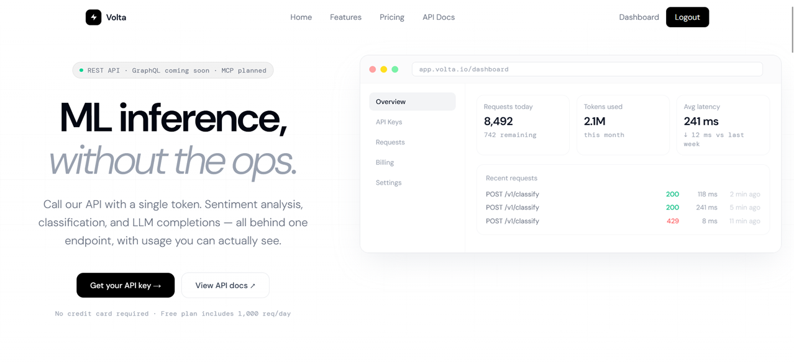
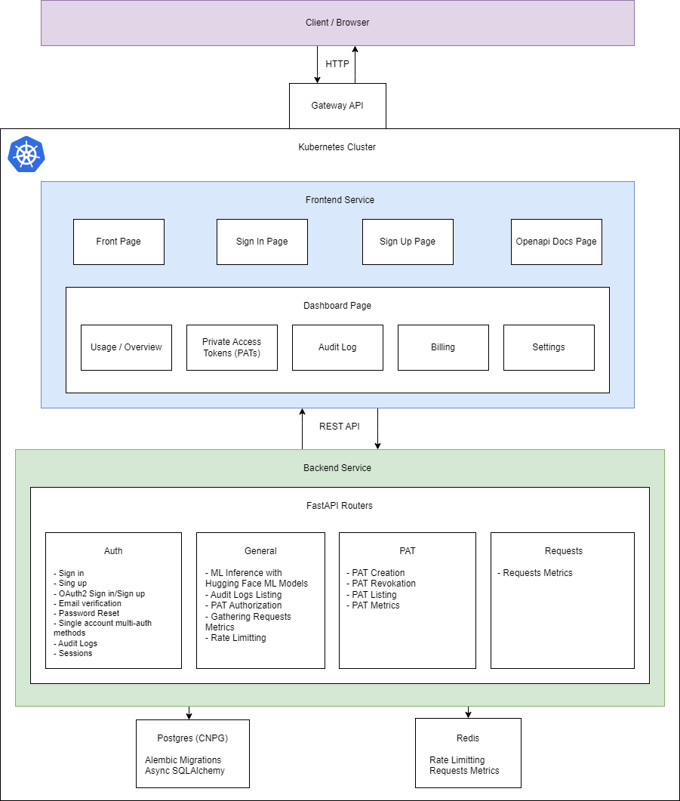

# Volta — ML Inference API Platform

> A production-grade MLOps project demonstrating end-to-end machine learning infrastructure: from model serving and API gateway design to Kubernetes deployment with GitOps, canary releases, and full observability.

---



## Overview

Volta is a full-stack ML inference platform built to reflect real-world MLOps and Platform Engineering practices. It exposes a HuggingFace sentiment analysis model through a secure, multi-tenant REST API, backed by a modern async Python backend, a React/TypeScript dashboard, and a Kubernetes-native deployment pipeline driven by ArgoCD and Argo Rollouts.

The project covers the nearly complete lifecycle of a production ML service: authentication and authorization, API gateway mechanics (rate limiting, audit logging), infrastructure-as-code, CI/CD with GitOps, progressive delivery, and integration testing — all on Google Kubernetes Engine.

---

## Architecture



**Deployment target:** Google Kubernetes Engine (GKE), managed by Terraform and operated via ArgoCD GitOps.

---

## Key Features

### Authentication & Authorization
- Server-side sessions with HttpOnly cookies — no JWT sprawl
- Personal Access Token (PAT) system for API access, gated behind email verification
- OAuth2 social login via Google and GitHub (Authlib), unified under a single `/auth/login_via/{provider}` route
- Password reset flow (forgot/reset pages, tokenized email links)
- Email verification with rate-limited resend (`/auth/resend-verification`)
- Timing-safe bcrypt login, separate 401/403 responses, account-activation gating
- Single account with multiple authorization methods (classical, login via Google or login via GitHub)
- Audit logs on login, oauth login, failed login, logout, PAT creation, PAT revokation, account verified, account's password changed, account verification resent

### API
- Redis-backed sliding-window rate limiting per user/token
- Clean separation between auth middleware and business logic
- Structured error responses normalized for frontend consumption (Pydantic v2 `detail` arrays)

### ML Inference
- HuggingFace `transformers` sentiment analysis model served via FastAPI
- Async request handling; model loaded once at startup

### Frontend Dashboard
- React + TypeScript + Remix (React Router) + Tailwind CSS
- Auth context with `refetch` pattern to prevent stale `/auth/me` state across navigation
- Token management dashboard: create, list, revoke PATs with paginated loading
- Account-activation banner blocking PAT interactions for unverified users
- OAuth2 redirect flows terminating cleanly into the same session

### Infrastructure & GitOps
- **Terraform** — GKE cluster, VPC, MetalLB, Traefik (Gateway API controller), GCP IAM
- **ArgoCD** — GitOps continuous delivery; PreSync hook Jobs run Alembic migrations before rollout
- **Argo Rollouts** — canary deployment strategy for staging and production
- **Kustomize overlays** — `dev` converts Argo Rollout to plain Deployment via JSON patch; `staging`/`production` use canary Rollout
- **CNPG (CloudNativePG)** — managed PostgreSQL operator with `cnpg-cluster-app` secret integration

### CI/CD
- GitHub Actions pipeline: lint → test → Docker build → manifest update → ArgoCD sync
- Matrix build jobs with a manual git-retry loop to avoid race conditions on manifest commits
- `uv` for fast, reproducible Python dependency management (`uv.lock` pinned in Docker builds)
- Local workflow testing via `act`
- Release-Please release automation

### Development
- Tilt for local Kubernetes and code development flow
- Docker for local code development
- Devbox allows for portable, isolated dev environment
- Task for task automatization
- kind for local Kubernetes cluster development
- Mailpit for local email testing

---

## Tech Stack

| Layer | Technology |
|---|---|
| **Language** | Python 3.12, TypeScript |
| **Backend framework** | FastAPI, Pydantic v2 |
| **ORM / migrations** | SQLAlchemy (async), Alembic |
| **Database** | PostgreSQL (CNPG operator on GKE) |
| **Cache / rate limit** | Redis |
| **Auth** | Authlib (OAuth2), bcrypt, HttpOnly sessions |
| **ML model** | HuggingFace Transformers (sentiment analysis) |
| **Frontend** | React, TypeScript, Remix / React Router, Tailwind CSS |
| **Container** | Docker, `uv` for Python deps |
| **Orchestration** | Kubernetes (GKE), Kustomize |
| **GitOps** | ArgoCD, Argo Rollouts (canary) |
| **IaC** | Terraform |
| **Ingress** | Traefik, GKE Gateway API |
| **CI/CD** | GitHub Actions |
| **Testing** | pytest, pytest-asyncio, real PostgreSQL + Redis containers |
| **Local dev** | kind, Mailpit (email), devbox (WSL2), go-task |

---

## Testing Philosophy

Integration tests run against real infrastructure — no mocking of the database itself (although Redis is mocked):

- `asyncio_mode = "auto"` (pytest-asyncio)
- `db_session` fixture provides a real async SQLAlchemy session against a test PostgreSQL database
- `make_session` fixture authenticates a user and returns a session cookie for endpoint tests
- `flush_redis` autouse fixture clears Redis state between tests, ensuring isolation
- `AsyncMock` used only for external services (email sending via SMTP)
- OAuth2 endpoints covered by parametrized pytest tests across providers

---

## Local Development

### Prerequisites
- Docker + kind
- `devbox` (or manual: Python 3.12, Node 20, `uv`)
- `kubectl`, `helm`, `argocd` CLI

```bash
# Clone
git clone https://github.com/jegor377/mlops-project
cd mlops-project

task sync-deps

# Backend
cp .env.example .env
# Edit .env: DATABASE_URL, REDIS_URL, SECRET_KEY, OAuth credentials
# Also, make sure that you have created secret files in /run/secrets
# if you don't use any cloud secret storage 

# Run necessary services in Docker
task ml_server:create-docker-network
task ml_server:run-postgres-container
task ml_server:run-mailpit
task ml_server:run-redis

# Run migrations
task ml_server:upgrade-db

# Start backend
task ml_server:run-dev

# Frontend
cd frontend
npm install
cd ..
task frontend:run-dev
```

For the full Kubernetes stack locally, a `kind` cluster with Traefik and ArgoCD is used. See [`k8s/README.md`](k8s/README.md) for setup instructions.

---

## Project Structure

```
mlops-project/
├── devbox.d                         # Config files that install with Redis tools to Devbox
│   └── redis
├── frontend                         # Frontend service code
│   ├── app                          # Main frontend service code
│   │   ├── components               # React components
│   │   ├── context                  # React contexts
│   │   └── routes                   # React components representing pages that are accessible via React Router
│   └── public                       # Frontend public resources, fe. page favicon
├── gcloud                           # gcloud flakes needed for Devbox for GCP tools and Terraform authentication to GCP
├── k8s                              # Kubernetes resources
│   ├── argocd                       # ArgoCD resources
│   │   └── apps                     # ArgoCD apps that rely on project's services
│   └── services                     # Project's kubernetes services
│       ├── common-gw                # Common gateway for frontend and ml_server services. It's needed for openapi.json file for openapi docs route
│       │   ├── base                 # Common gateway base manifests
│       │   └── overlays             # Common gateway overlays
│       │       └── dev              # Common gateway dev overlay
│       │           ├── manifests    # Common gateway dev overlay manifests
│       │           └── patches      # Common gateway dev overlay patches
│       ├── frontend                 # Frontend service
│       │   ├── base                 # Frontend service manifests
│       │   └── overlays             # Frontend service overlays
│       │       ├── dev              # Frontend service dev overlay
│       │       │   ├── manifests    # Frontend service dev overlay manifests
│       │       │   └── patches      # Frontend service dev overlay patches
│       │       ├── production       # Frontend service production overlay
│       │       │   └── patches      # Frontend service production overlay patches
│       │       └── staging          # Frontend service staging overlay
│       │           └── patches      # Frontend service staging overlay patches
│       └── ml_server                # Backend service
│           ├── base                 # Backend service manifests
│           └── overlays             # Backend service overlays
│               ├── common           # Backend service common manifests for all environemnts
│               ├── dev              # Backend service dev overlay
│               │   ├── manifests    # Backend service dev overlay manifests
│               │   └── patches      # Backend service dev overlay patches
│               ├── production       # Backend service production overlay
│               │   └── patches      # Backend service production overlay patches
│               └── staging          # Backend service staging overlay
│                   └── patches      # Backend service staging overlay patches
├── ml_server                        # Backend service code
│   ├── migrations                   # Alembic migrations
│   │   └── versions
│   └── src                          # Main backend service code
│       ├── ml_server                # Main code
│       │   ├── conf                 # Backend configuration (pydantic-settings)
│       │   ├── dependencies         # Dependencies for FastAPI routes
│       │   ├── models               # SQLAlchemy models
│       │   ├── routes               # FastAPI routes
│       │   ├── schemas              # Pydantic schemas for FastAPI routes
│       │   ├── services             # Routes' services, fe. email sending, ML inference classes, etc...
│       │   └── utils                # Helper packages
│       └── tests                    # Tests for main code
│           ├── api                  # Integration tests
│           └── unit                 # Unit tests
├── models                           # ML models weights for PyTorch (fe. sentiment analysis LLM model weights)
├── terraform                        # Terraform resources
│   ├── dev                          # Development environment Terraform resources
│   │   └── manifests                # Kubernetes helper resources (fe. Gateway API CRDs)
│   └── gcp                          # GCP environemnt resources for setting up production and staging environments on GKE
└── utils                            # Taskfile with tasks for CI/CD version management
```

---